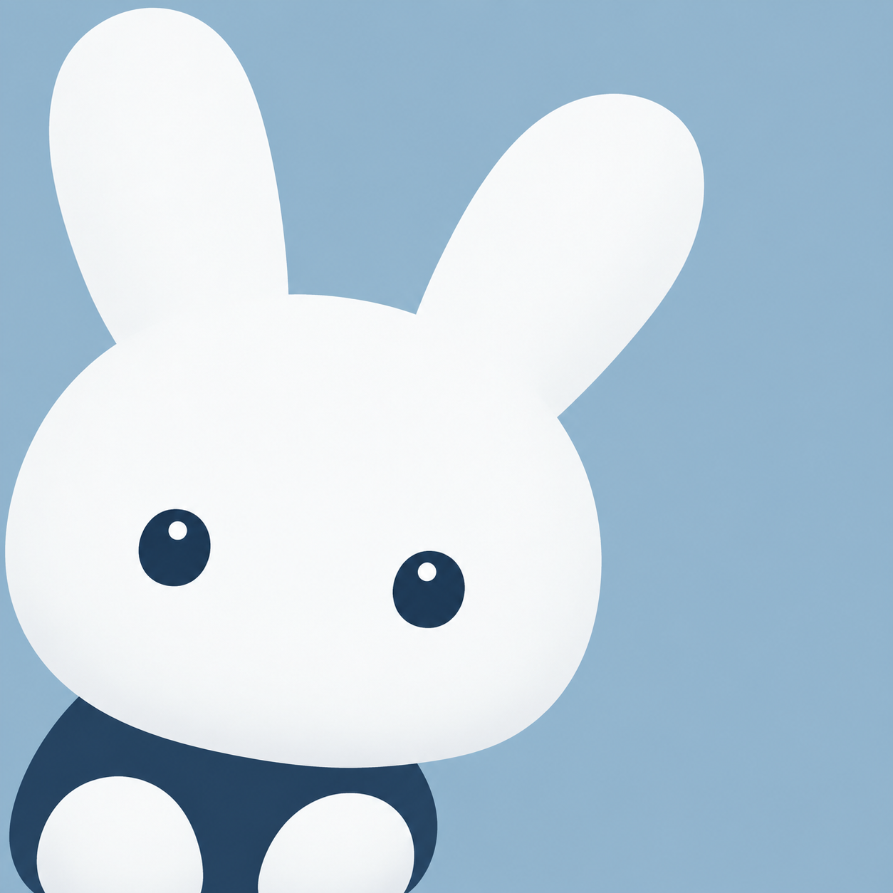
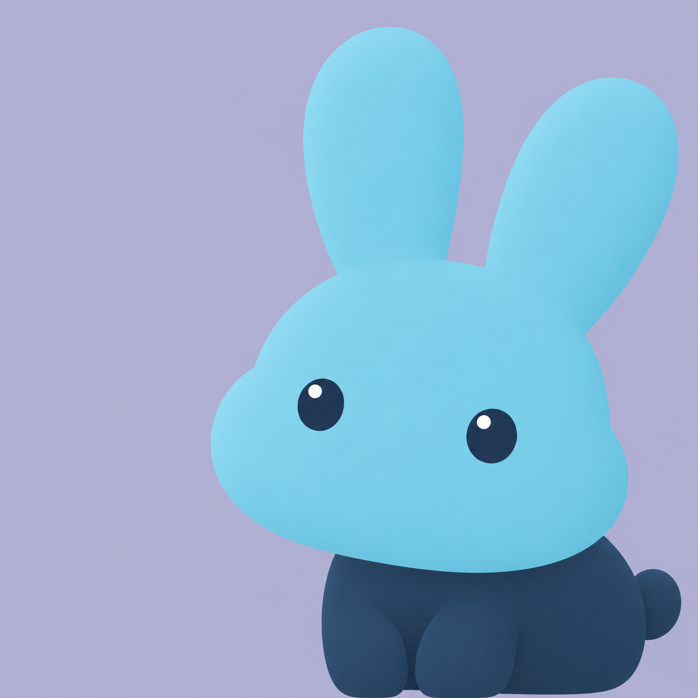
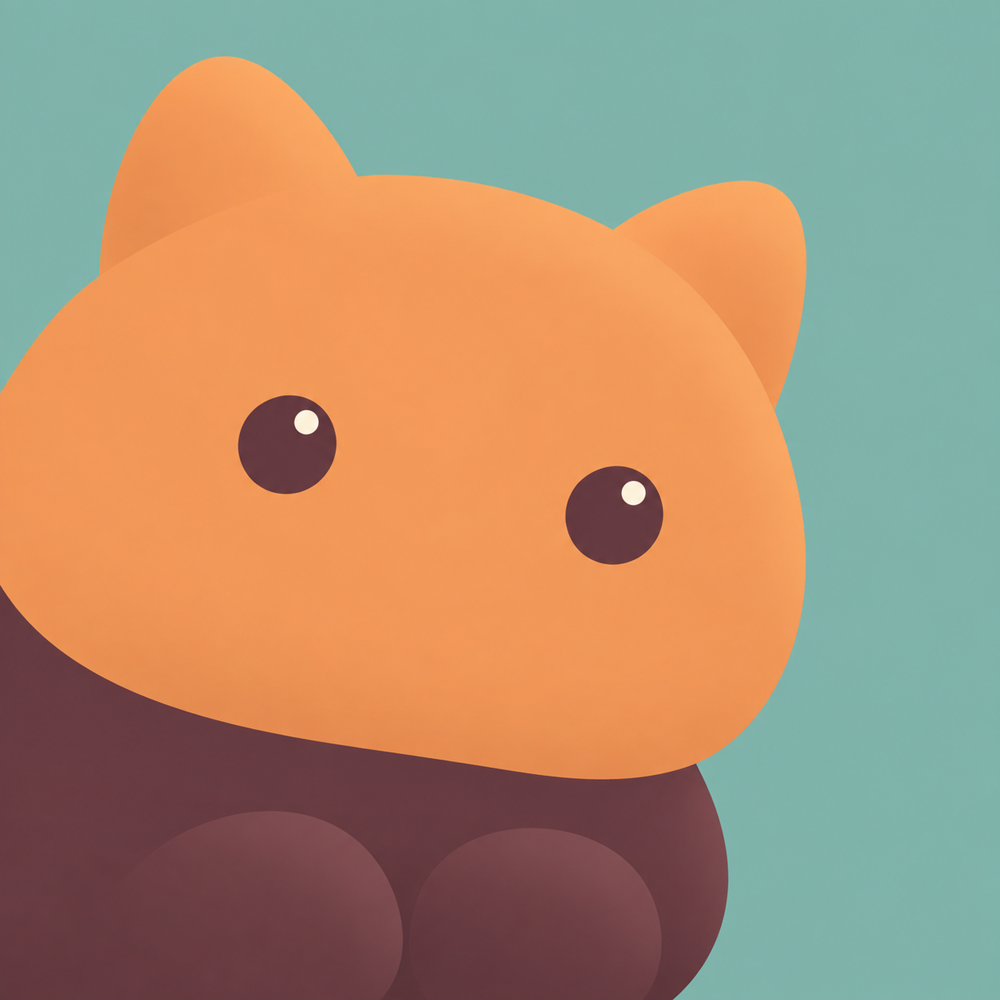
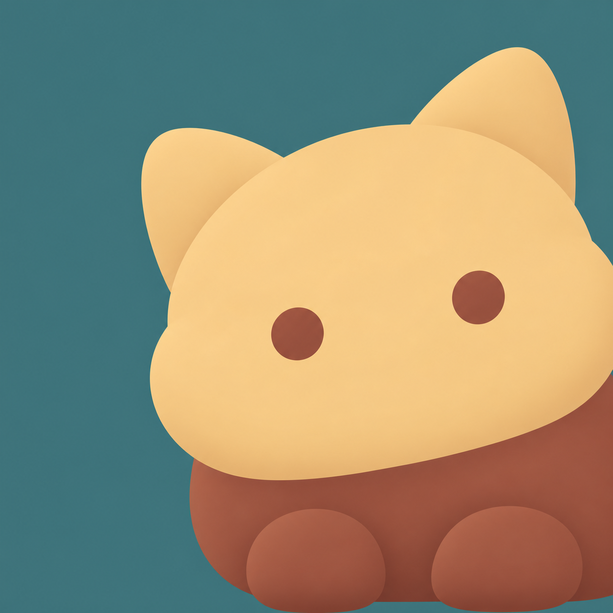
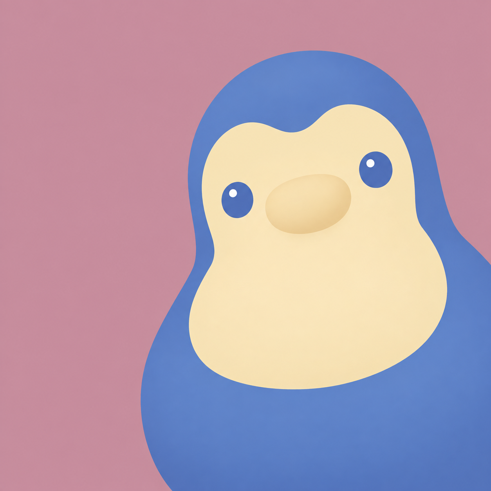

# XIVChat Next · Logo 候选

2026-09-10。雪兔、圆猫、信鸽各两张，共六张独立生成的候选。供客户端与 Dalamud 插件选择共同的吉祥物方向。

每张仅生成一次，保留完整原始图片；未筛选、重绘、裁切、缩放或替换现有产品图标。

## 候选与方向

| 编号 / 原图 | 方向与产品关联 | 构图 | 提示词配色（角色 × 2 / 背景 × 1） | 完整提示词 |
| --- | --- | --- | --- | --- |
| [A1](A1.png) | 雪兔：Hare、倾听与远程联络 | 左下 | snow white #F4F7F8、deep ink blue #203D58 / gently muted sky blue #9DBACF | [A1.txt](prompts/A1.txt) |
| [A2](A2.png) | 雪兔：Hare、倾听与远程联络 | 右下 | glacial blue #71C7DF、midnight blue #203955 / gently muted periwinkle #B5B5D6 | [A2.txt](prompts/A2.txt) |
| [B1](B1.png) | 圆猫：好友陪伴与日常聊天 | 左下 | warm apricot orange #ED985C、deep cocoa #5B3540 / gently muted mist teal #83B5AD | [B1.txt](prompts/B1.txt) |
| [B2](B2.png) | 圆猫：好友陪伴与日常聊天 | 右下 | buttercream gold #F3CA8C、burnt terracotta #954C3E / gently muted deep teal #3F7277 | [B2.txt](prompts/B2.txt) |
| [C1](C1.png) | 信鸽：远程消息与可靠传递 | 左下 | deep indigo #324D81、warm cream #F5DB93 / gently muted lavender #ABA4CB | [C1.txt](prompts/C1.txt) |
| [C2](C2.png) | 信鸽：远程消息与可靠传递 | 右下 | cornflower blue #557BC1、pale warm cream #F6E3B4 / gently muted dusty rose #C795A4 | [C2.txt](prompts/C2.txt) |

## 生成记录

- 工具 / provider：OpenAI 内置 `image_gen`。
- 具体模型：服务未返回模型名称，工具未开放模型选择参数。
- 约束传递：`main-prompt constraints`，全部写入各图的完整主提示词。
- 六次独立调用，无参考图片；每次只请求一张独立方形图片。
- 请求尺寸：约 1536 × 1536；实际工具输出均为 1254 × 1254 PNG，按原尺寸保留。
- 配色数值为提示词目标，未进行输出像素校色。
- 所有图片已打开检查；尺寸与 SHA-256 记录见 [files.json](files.json)。

## 并排预览

| A1 · 雪兔 · 雪白 / 天蓝 | A2 · 雪兔 · 冰蓝 / 浅紫 |
| --- | --- |
|  |  |

| B1 · 圆猫 · 杏橙 / 雾青 | B2 · 圆猫 · 奶油 / 深青 |
| --- | --- |
|  |  |

| C1 · 信鸽 · 靛蓝 / 淡紫 | C2 · 信鸽 · 蓝色 / 玫瑰 |
| --- | --- |
|  |  |

用户于 2026-09-10 选定 C1，两端共用。正式资源与导出方法见 [branding](../../README.md)。
